# Weather Station Class Diagram

```mermaid
classDiagram
    class app_main {
        -unique_ptr~CMQTTWrapper~ mqtt_mng
        -unique_ptr~bme680_sensor~ bme680_p
        -unique_ptr~bh1750_sensor~ bh1750_p
        -unique_ptr~adc_sensor~ adc_p
        -unique_ptr~ESPTimer~ sleep_timer
        -map~string,string~ sensors_data
        -EventGroupHandle_t app_main_event_group
        -chrono_seconds deep_sleep_duration
        +init()
        +sensors_off()
        +shootdown()
        +collect_sensors_data(field, value)
        +event_got_ip_handler()
    }

    class CMQTTWrapper {
        -device_info_t device_info_
        -Filter device_cmd_
        -Filter brodcast_cmd_
        -unique_ptr~command_cb_t~ device_cmd_cb_
        -unique_ptr~all_send_cb_t~ all_send_cb_
        -unique_ptr~connection_state_cb_t~ connection_state_cb_
        -set~MessageID~ send_mgs_list_
        +CMQTTWrapper(device_info, cmd_cb, state_cb)
        +publish(topic, message)
        +publish_device_brunch(field, value)
        +is_all_send()
        +is_all_send_cb(callback)
        -on_connected(event)
        -on_disconnected(event)
        -on_published(event)
        -on_data(event)
        -send_advertisement()
    }

    class device_info_t {
        +string sw
        +string ip
        +string mac
    }

    class generic_cb~T~ {
        <<abstract>>
        #getter_t~T~ getter_
        #on_success_cb_t~T~ on_success_
        #on_error_cb_t on_error_
        #const char* tag_
        +generic_cb(tag, getter, on_success, on_error)
    }

    class timed_cb~T~ {
        #int retry_
        #unique_ptr~ESPTimer~ timer_p_
        +timed_cb(tag, getter, on_success, on_error, start_delay, retry, retry_timeout)
    }

    class bme680_sensor {
        -unique_ptr~timed_cb~sensor_value_t~~ handler_
        -bme680_t dev_
        +sensor(on_success, on_error)
        +~sensor()
        -get_value(value) bool
    }

    class bh1750_sensor {
        -unique_ptr~timed_cb~sensor_value_t~~ handler_
        -i2c_dev_t dev_
        +sensor(on_success, on_error)
        +~sensor()
        -get_value(value) bool
    }

    class adc_sensor {
        -uint8_t fails_in_row_
        -unique_ptr~ESPTimer~ timer_p_
        -average~sensor_value_t~ average_
        -adc_oneshot_unit_handle_t adc_handle_
        +sensor(on_success, on_error)
        +~sensor()
        -get_value(value) bool
    }

    class average~T_S~ {
        #const uint8_t capacity_
        #queue~T~ queue_
        #S summ_
        +average(capacity)
        +push(value)
        +get_size() T
        +get_capacity() uint16_t
        +get_average() T
    }

    class average_treshold~T_S~ {
        -const T treshold_
        -T prev_
        +average_treshold(treshold, deep)
        +push(value) bool
        #re_arm()
    }

    class average_treshold_timeout~T_S~ {
        -const chrono_milliseconds keep_alive_
        -chrono_time_point next_
        +average_treshold_timeout(treshold, deep, keep_alive)
        +push(value) bool
    }

    class ESPTimer {
        +start(duration)
        +stop()
    }

    class kvs_handler {
        -unique_ptr~NVSHandle~ handle_
        -bool updated_
        +handler(ns_name)
        +get_value(key, value)
        +set_value(key, value)
        +get_value_or(key, value, default)
        -set_item_(key, value)
    }

    class blink {
        <<namespace>>
        +init()
        +start(state)
        +stop(state)
    }

    class provision {
        <<namespace>>
        +provision_main()
        +provision_reset()
    }

    class deepsleep {
        <<namespace>>
        +get_boot_count() uint32_t
        +sleep(duration)
    }

    class utils {
        <<namespace>>
        +get_mac() string
        +to_Str(ip) string
        +print_info()
        +transform_range(in_min, in_max, out_min, out_max, value) T
    }

    timed_cb --|> generic_cb : inherits
    average_treshold --|> average : inherits
    average_treshold_timeout --|> average_treshold : inherits
    adc_sensor --|> generic_cb : inherits

    app_main --> CMQTTWrapper : creates
    app_main --> bme680_sensor : creates
    app_main --> bh1750_sensor : creates
    app_main --> adc_sensor : creates
    app_main --> ESPTimer : creates
    app_main --> provision : calls
    app_main --> deepsleep : calls
    app_main --> blink : calls
    app_main --> utils : calls

    CMQTTWrapper --> device_info_t : contains

    bme680_sensor --> timed_cb : contains
    bh1750_sensor --> timed_cb : contains
    adc_sensor --> ESPTimer : contains
    adc_sensor --> average : contains

    timed_cb --> ESPTimer : contains
```

## Key Classes

### Main Application
- **app_main**: Entry point, orchestrates sensors, MQTT, and deep sleep
  - Event flags: GOT_IP, GOT_SENSOR_DATA, GOT_LIGHTING_DATA, GOT_BAT, MQTT_EMPTY
  - Manages deep_sleep_duration (normal or low battery mode)

### MQTT Communication
- **CMQTTWrapper**: MQTT client wrapper for publishing sensor data
- **device_info_t**: Device identification (MAC, IP, SW version)

### Sensor Base Classes
- **generic_cb<T>**: Abstract base with getter, success/error callbacks
- **timed_cb<T>**: Extends generic_cb with timer and retry logic
  - Used by BME680 and BH1750 sensors

### Sensors
- **bme680::sensor**: Temperature, humidity, pressure (I2C)
  - sensor_value_t = bme680_values_float_t
  - Uses timed_cb for periodic reads
- **bh1750::sensor**: Light intensity (I2C)
  - sensor_value_t = uint16_t (lux)
  - Uses timed_cb for periodic reads
- **adc::sensor**: Battery voltage (ADC_CHANNEL_0)
  - sensor_value_t = int
  - Inherits from generic_cb
  - Uses ESPTimer + average for smoothing
  - Tracks fails_in_row (max: CONFIG_ADC_MAX_FAILS_IN_ROW)

### Utilities
- **average<T,S>**: Rolling average with fixed capacity queue
- **average_treshold<T,S>**: Extends average, triggers on threshold change
- **average_treshold_timeout<T,S>**: Adds keep-alive timeout
- **ESPTimer**: Timer wrapper (idf::esp_timer::ESPTimer)
- **kvs::handler**: Key-value storage (NVS) wrapper
- **blink**: LED indicator control (namespace)
- **provision**: WiFi provisioning (namespace)
- **deepsleep**: Deep sleep management (namespace)
- **utils**: Helper functions (namespace)

## Relationships

- app_main creates unique_ptr instances of all sensors and MQTT
- BME680/BH1750 use timed_cb (inherits generic_cb) for async reads
- ADC sensor inherits generic_cb directly, uses ESPTimer + average
- All sensors invoke callbacks on success/error
- CMQTTWrapper publishes collected sensor data to MQTT broker
- ESPTimer provides timeout protection (sleep_timer in app_main)
- Sensors destroyed via sensors_off() before deep sleep

## Memory Management

- All major objects use std::unique_ptr for automatic cleanup
- Sensors destroyed before deep sleep to save power
- MQTT wrapper destroyed after all messages sent
