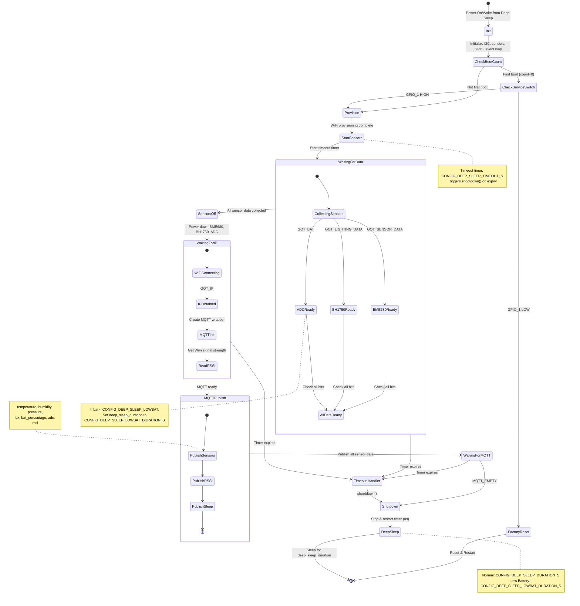

# Weather Station State Diagram

## Event Flags

- **GOT_IP**: WiFi connected and IP obtained (BIT0)
- **GOT_SENSOR_DATA**: BME680 temperature/humidity/pressure data ready (BIT1)
- **GOT_LIGHTING_DATA**: BH1750 light sensor data ready (BIT2)
- **GOT_BAT**: ADC battery voltage data ready (BIT3)
- **MQTT_EMPTY**: All MQTT messages sent (BIT4)

## Sensors

- **BME680**: Temperature, humidity, pressure sensor (I2C)
- **BH1750**: Light sensor (I2C)
- **ADC**: Battery voltage monitoring (ADC_CHANNEL_0, GPIO_NUM_0)

## Key States

1. **Init**: Initialize I2C (i2cdev_init), event loop, GPIO, create sensors
2. **CheckBootCount**: Check deepsleep::get_boot_count() == 0 for first boot
3. **CheckServiceSwitch**: Check GPIO_1 level for factory reset (LOW = reset)
4. **Provision**: WiFi provisioning via provision_main()
5. **StartSensors**: Start timeout timer (CONFIG_DEEP_SLEEP_TIMEOUT_S)
6. **WaitingForData**: Parallel sensor data collection via callbacks
7. **SensorsOff**: Destroy sensor objects (bme680_p, bh1750_p, adc_p)
8. **WaitingForIP**: Wait for IP_EVENT_STA_GOT_IP event
9. **MQTTPublish**: Publish collected data (temperature, humidity, pressure, lux, bat_percentage, adc, rssi, sleep)
10. **Shutdown**: Stop timer, call shootdown() → deepsleep::sleep()
11. **DeepSleep**: Enter low-power mode for deep_sleep_duration

## Data Collection

Sensor data is collected via callbacks into `sensors_data` map:
- BME680: temperature, humidity, pressure
- BH1750: lux
- ADC: bat_percentage (transformed from CONFIG_BATTERY_MIN/MAX), adc raw value
- WiFi: rssi (signal strength)
- System: sleep duration

## Low Battery Handling

If battery percentage < CONFIG_DEEP_SLEEP_LOWBAT:
- deep_sleep_duration changes from CONFIG_DEEP_SLEEP_DURATION_S to CONFIG_DEEP_SLEEP_LOWBAT_DURATION_S

## Timeout Protection

A watchdog timer (sleep_timer) runs for CONFIG_DEEP_SLEEP_TIMEOUT_S. If any state takes too long, shootdown() is called, forcing sensors off and entering deep sleep.

## GPIO Configuration

- **GPIO_NUM_1**: Service switch (input, pull-up enabled)
  - LOW on first boot → Factory reset
  - HIGH → Normal operation
